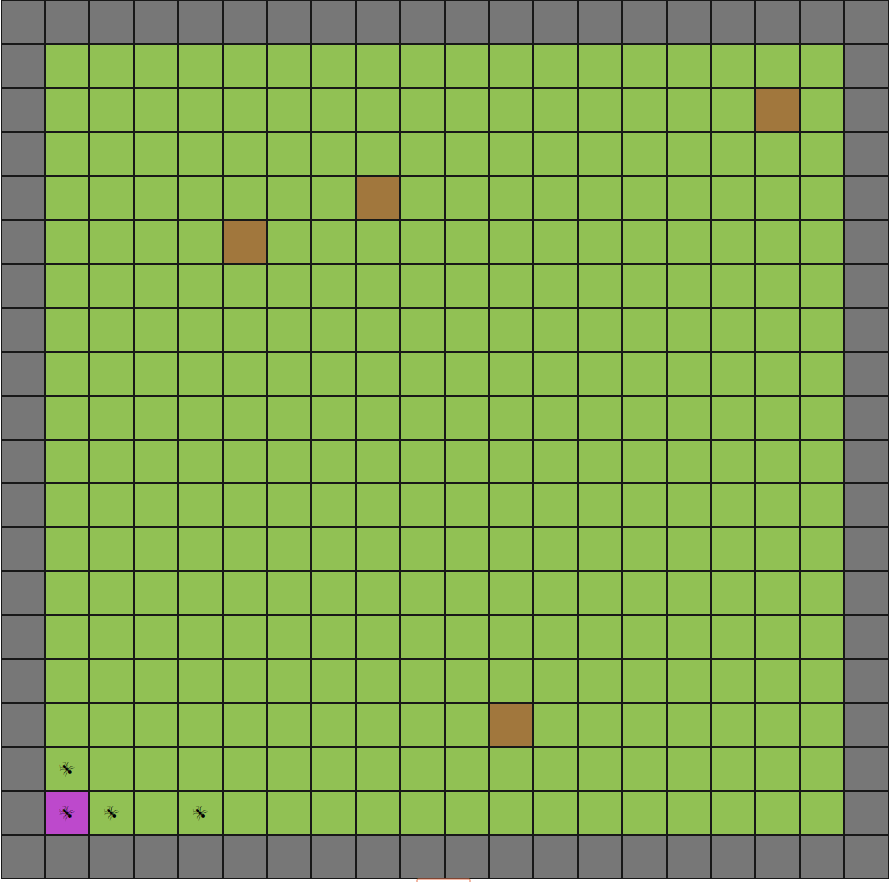

# Ants

To start your Phoenix server:

* Install dependencies with `mix deps.get`
* Install Node.js dependencies with `cd assets && yarn install`
* Start Phoenix with `mix phx.server`
* Start Reason with `yarn start` in another terminal

Now you can visit [`localhost:4000`](http://localhost:4000) from your browser.
